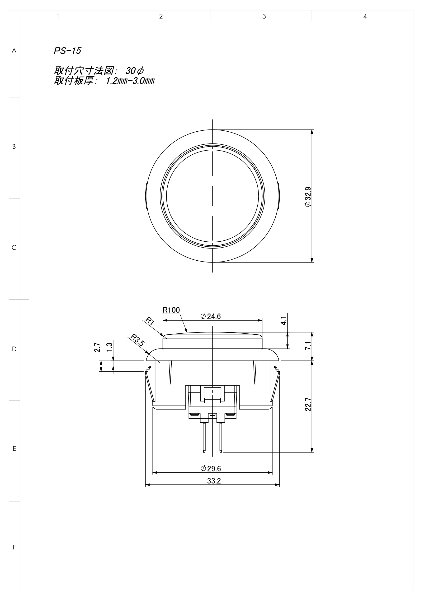

# PS-15 Button Box

A 3D-printable single-button enclosure for the Seimitsu PS-15 arcade button.



## Features

- Designed for **Seimitsu PS-15** (φ30mm mount hole, 1.2–3.0mm panel thickness)
- **Perfect cube**: 47 × 47 × 47mm assembled (body 44mm + lid 3mm)
- **FDM-optimized**: +0.2mm hole compensation, no supports required for either part
- **Two-point diagonal fastening**: M3×50 button-head bolt + M3 heat-press insert nut (8mm)
- **Dual mounting**: screw to wooden panel (φ4 wood screw) or use standalone
- **Wire slot**: U-slot 12mm × 10mm on right side wall
- **Engravings**: "NongSoft LLC / 2026" inside box bottom + lid back

## Files

| File | Description |
|------|-------------|
| `ps15_box.scad` | OpenSCAD source (all parameters adjustable) |
| `ps15_box_body.stl` | Body STL for 3D printing |
| `ps15_lid.stl` | Lid STL for 3D printing |
| `ps15_box_body.step` | Body STEP (for CAD import) |
| `ps15_lid.step` | Lid STEP (for CAD import) |
| `ps15_box_spec.md` | Full specification sheet |
| `stl_to_step.py` | FreeCAD 1.1 STL→STEP conversion script |

## Print Settings

| Parameter | Value |
|-----------|-------|
| Material | **PETG** (PLA not recommended — low heat deflection for heat inserts) |
| Layer height | 0.2mm |
| Walls | 6 perimeters |
| Infill | 30–40% Gyroid |
| Body orientation | Open side up, no supports |
| Lid orientation | Flat side (inner face) down, no supports |

## Hardware

| Item | Spec | Qty |
|------|------|-----|
| M3 button-head bolt | M3 × 50mm | 2 |
| Heat-press insert nut | M3, OD φ4.6mm, L 8mm, brass | 2 |
| Button | Seimitsu PS-15 | 1 |

**Insert nut sources:**
- MISUMI: `BNTS3-8` (M3, brass, L=8mm)
- Amazon.co.jp: uxcell / SUNGQ 50-pack

## OpenSCAD Usage

### Customizer

- **断面表示 (Section view)**: toggle `show_section`, choose axis and position
- **出力 (Export)**: set `render_part` — 0=view, 1=body, 2=lid

### Re-export STL

```bat
set SCAD="C:\Program Files\OpenSCAD\openscad.exe"
%SCAD% -D "render_part=1" -o ps15_box_body.stl ps15_box.scad
%SCAD% -D "render_part=2" -o ps15_lid.stl      ps15_box.scad
```

### Re-export STEP (requires FreeCAD 1.1)

```bat
freecadcmd.exe stl_to_step.py
```

## License

[MIT License](LICENSE)

---

*Designed by NongSoft LLC — 2026*
